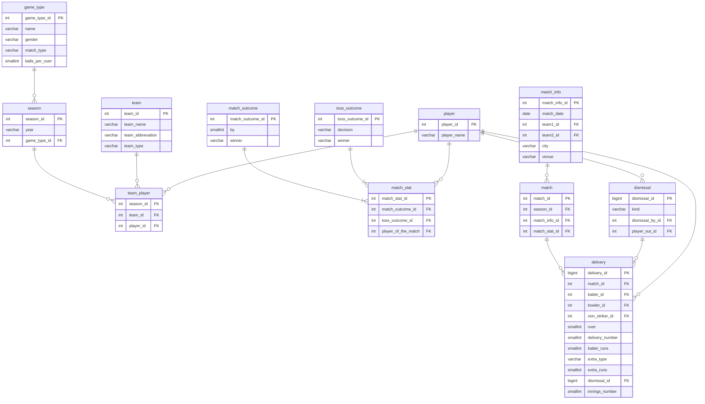

```mermaid
erDiagram
    season {
        int season_id PK
        varchar year
        int game_type_id FK
    }

    team {
        int team_id PK
        varchar team_name
        varchar team_abbrevation
        varchar team_type
    }

    player {
        int player_id PK
        varchar player_name
    }

    team_player {
        int season_id FK
        int team_id FK
        int player_id FK
    }

    match_info {
        int match_info_id PK
        date match_date
        int team1_id FK
        int team2_id FK
        varchar city
        varchar venue
    }

    toss_outcome {
        int toss_outcome_id PK
        varchar decision
        varchar winner
    }

    match_outcome {
        int match_outcome_id PK
        smallint by
        varchar winner
    }

    match_stat {
        int match_stat_id PK
        int match_outcome_id FK
        int toss_outcome_id FK
        int player_of_the_match FK
    }

    match {
        int match_id PK
        int season_id FK
        int match_info_id FK
        int match_stat_id FK
    }

    dismissal {
        bigint dismissal_id PK
        varchar kind
        int dismissal_by_id FK
        int player_out_id FK
    }

    delivery {
        bigint delivery_id PK
        int match_id FK
        int batter_id FK
        int bowler_id FK
        int non_striker_id FK
        smallint over
        smallint delivery_number
        smallint batter_runs
        varchar extra_type
        smallint extra_runs
        bigint dismissal_id FK
        smallint innings_number
    }

    game_type {
        int game_type_id PK
        varchar name
        varchar gender
        varchar match_type
        smallint balls_per_over
    }

    %% Relationships
    season ||--o{ team_player : ""
    team ||--o{ team_player : ""
    player ||--o{ team_player : ""
    match_info ||--o{ match : ""
    match_outcome ||--|{ match_stat : ""
    toss_outcome ||--|{ match_stat : ""
    player ||--o{ match_stat : ""
    match ||--o{ delivery : ""
    player ||--o{ dismissal : ""
    dismissal ||--o{ delivery : ""
    player ||--o{ delivery : ""
    game_type ||--o{ season : ""
```